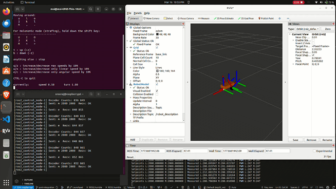
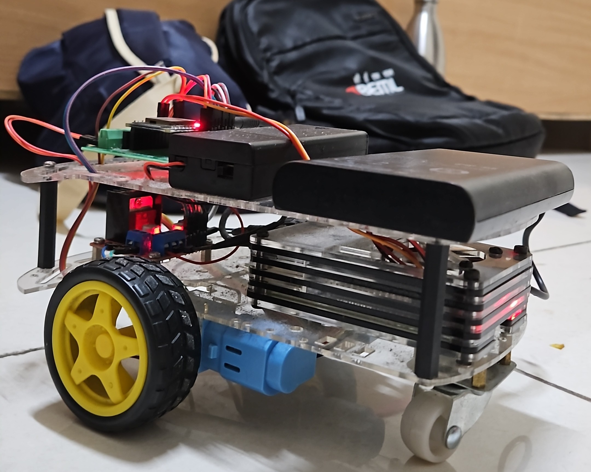

# diffdrive_esp32 — ROS2 Hardware Interface for DiffBot

A ROS2 `ros2_control` hardware interface plugin for a two-wheel differential drive robot (DiffBot). Runs on a Raspberry Pi 4 (Ubuntu 22.04, ROS2 Humble) and communicates with an ESP32 microcontroller over UART serial.

> **Status:** MK1 active — closed loop working, SLAM integration in progress.

---

## Demo

### Robot Moving — Closed Loop Velocity Control


### RViz2 — Both Wheel TFs Tracking in Sync


---

## Overview

This package bridges ROS2's `diff_drive_controller` and the physical robot hardware. It implements the `hardware_interface::SystemInterface` plugin that:

- Sends velocity commands (rad/s → ticks/sec) to the ESP32 over UART serial
- Reads encoder counts from the ESP32 and computes wheel position and velocity
- Exposes position and velocity state interfaces to the ROS2 control framework

```
ROS2 Control Framework
        │
        │  ros2_control hardware interface plugin
        ▼
DiffDriveEsp32Hardware  (this package)
        │
        │  UART serial @ 115200 baud
        │  /dev/serial0  (RPi GPIO UART)
        ▼
ESP32 Firmware  (esp32_ws)
        │
        ├── Left motor + encoder  (GPIO34/35)
        └── Right motor + encoder (GPIO32/33)
```

---

## System Architecture

| Layer | Component | Role |
|---|---|---|
| Trajectory | `diff_drive_controller` | Converts cmd_vel → wheel velocity |
| Hardware Interface | `diffdrive_esp32` (this) | Bridges ROS2 control ↔ ESP32 serial |
| Firmware | `esp32_ws` | PID velocity control, encoder reading |
| State Publishing | `robot_state_publisher` | Publishes TF from URDF |
| Visualisation | `rviz2` | Robot model and odometry display |

---

## Hardware

| Component | Details |
|---|---|
| On-board computer | Raspberry Pi 4 8GB |
| OS | Ubuntu 22.04 Server |
| ROS2 | Humble |
| MCU | ESP32-WROOM-32E |
| Serial connection | RPi GPIO UART (`/dev/serial0`) |
| LiDAR | Slamtec RPLIDAR A1 *(SLAM integration in progress)* |
| Encoder resolution | 1056 ticks/rev (DG01D-E) |
| Wheel radius | 32.5 mm |
| Wheel separation | 100 mm |

### MK1 Hardware


---

## Dependencies

```bash
# ROS2 packages
sudo apt install \
  ros-humble-hardware-interface \
  ros-humble-pluginlib \
  ros-humble-rclcpp \
  ros-humble-rclcpp-lifecycle \
  ros-humble-diff-drive-controller \
  ros-humble-joint-state-broadcaster \
  ros-humble-controller-manager \
  ros-humble-robot-state-publisher \
  ros-humble-rviz2

# System
sudo apt install libserial-dev
```

---

## Build

```bash
source /opt/ros/humble/setup.bash

cd ~/ros2_ws/src
git clone https://github.com/Sreerajvr172001/diffdrive_esp32.git

cd ~/ros2_ws
rosdep install --from-paths src --ignore-src -r -y
colcon build --packages-select diffdrive_esp32
source install/setup.bash
```

---

## Launch

```bash
ros2 launch diffdrive_esp32 diffbot.launch.py
```

This starts the `ros2_control_node`, `robot_state_publisher`, `joint_state_broadcaster`, and `diffbot_base_controller` in the correct order with event-based sequencing.

**Teleoperation (from laptop on same ROS2 domain):**
```bash
ros2 run teleop_twist_keyboard teleop_twist_keyboard \
  --ros-args --remap /cmd_vel:=/diffbot_base_controller/cmd_vel_unstamped
```

**Visualise in RViz2:**
```bash
rviz2 -d $(ros2 pkg prefix diffdrive_esp32)/share/diffdrive_esp32/diffbot.rviz
```

---

## Configuration

Hardware parameters in `description/ros2_control/diffbot.ros2_control.xacro`:

| Parameter | Value | Notes |
|---|---|---|
| `device` | `/dev/serial0` | RPi GPIO UART |
| `baud_rate` | `115200` | Must match ESP32 firmware |
| `timeout_ms` | `100` | Serial read timeout — tuned for 20Hz control loop |
| `enc_counts_per_rev` | `1056` | DG01D-E encoder resolution |
| `MAX_TICKS_PER_SEC` | `2000` | Velocity command ceiling |
| `pid_p_l/r` | `0.5` | Initial Kp — tune on hardware |
| `pid_i_l/r` | `0` | Initial Ki |
| `pid_d_l/r` | `0` | Initial Kd |

Controller parameters in `bringup/config/diffbot_controllers.yaml`:

| Parameter | Value | Notes |
|---|---|---|
| `wheel_separation` | `0.10` | Measure precisely — affects all odometry |
| `wheel_radius` | `0.0325` | 65mm wheel / 2 |
| `update_rate` | `50 Hz` | Controller manager rate |
| `open_loop` | `false` | Closed loop — requires working encoders |
| `angular.z.max_velocity` | `3.0` | rad/s — safe for indoor use |
| `linear.x.max_velocity` | `0.5` | m/s |

---

## Repository Structure

```
diffdrive_esp32/
├── hardware/
│   ├── diffbot_system.cpp                    # Hardware interface implementation
│   └── include/diffdrive_esp32/
│       ├── diffbot_system.hpp                # Hardware interface header
│       ├── esp32_comms.hpp                   # Serial communication layer
│       ├── wheel.hpp                         # Wheel odometry helper
│       └── visibility_control.h              # DLL export macros
├── description/
│   ├── ros2_control/
│   │   └── diffbot.ros2_control.xacro        # Hardware parameters
│   ├── urdf/
│   │   ├── diffbot.urdf.xacro                # Top-level URDF
│   │   ├── diffbot_description.urdf.xacro    # Robot geometry
│   │   └── diffbot.materials.xacro           # RViz materials
│   └── rviz/
│       ├── diffbot.rviz                      # RViz config (odom frame)
│       └── diffbot_view.rviz                 # RViz config (base_link frame)
├── bringup/
│   ├── launch/diffbot.launch.py              # Main launch file
│   └── config/diffbot_controllers.yaml       # Controller parameters
├── CMakeLists.txt
├── package.xml
└── diffdrive_esp32.xml                       # pluginlib plugin description
```

---

## Planned Upgrades

| Feature | Status |
|---|---|
| RPLIDAR A1 + slam_toolbox SLAM | 🔧 In progress |
| IMU fusion with robot_localization EKF | 📋 MK2 |
| Cytron SPG30E-60K motors + MDD10A driver | 📋 MK2 |
| Jetson Orin Nano Super + OAK-D Lite AF | 📋 MK3 |
| Nav2 autonomous navigation | 📋 MK3 |
| Semantic mapping (YOLO + SLAM map) | 📋 MK3 |
| LangGraph agentic AI with ROS2 tool calls | 📋 MK3 |

---

## Acknowledgements

This package is based on and modified from [diffdrive_arduino](https://github.com/joshnewans/diffdrive_arduino) by [Josh Newans](https://github.com/joshnewans), which builds on the [ros2_control](https://github.com/ros-controls/ros2_control) framework templates. Original code licensed under Apache 2.0.

**Key modifications from the original:**
- Replaced Arduino serial protocol with custom ESP32 UART2 command protocol (`m`, `e`, `l`, `n` commands)
- Added separate left/right PID parameter support via `l` and `n` serial commands
- Added `MAX_TICKS_PER_SEC` velocity clamping in `write()`
- Added `timeout_ms` serial read timeout with partial response recovery
- Removed `loop_rate` dependency — switched to ticks/sec velocity units
- Added `delta_seconds` guard against division by zero in velocity calculation
- Added `pos_prev` as `double` for full precision odometry accumulation
- Added `\r` stripping on received serial tokens

---

## License

This package is licensed under the [Apache License 2.0](LICENSE).

Files `hardware/diffbot_system.cpp`, `hardware/include/diffdrive_esp32/diffbot_system.hpp`, and `hardware/include/diffdrive_esp32/visibility_control.h` retain their original copyright notice from the ros2_control Development Team (2021).

Files `hardware/include/diffdrive_esp32/esp32_comms.hpp` and `hardware/include/diffdrive_esp32/wheel.hpp` are Copyright 2025 Sreeraj V R, licensed under Apache 2.0.

---

## Related Repository

ESP32 firmware that this middleware communicates with:
👉 [esp32_ws](https://github.com/Sreerajvr172001/esp32_ws)

---

## Author

**Sreeraj V R**
Engineer (Grade II), BEML Ltd R&D | Robotics
[LinkedIn](https://linkedin.com/in/sreerajvr172001) · [GitHub](https://github.com/Sreerajvr172001)
